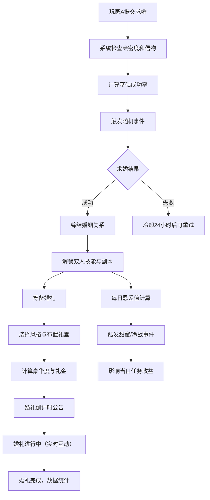
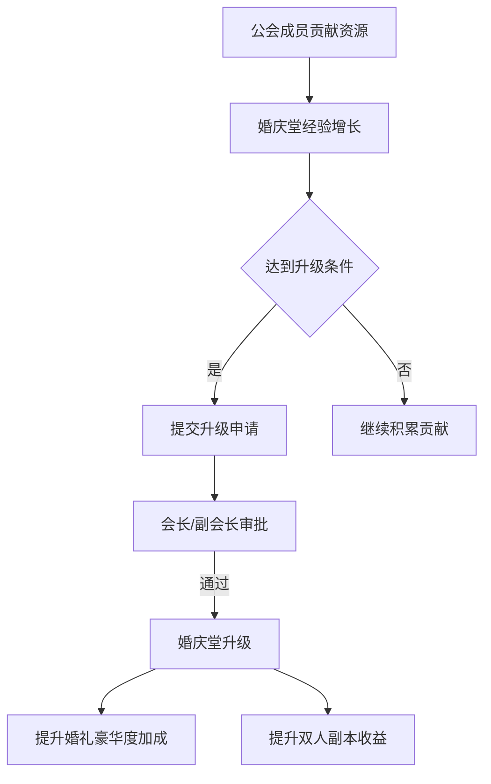

## 1. 产品概述

多人在线魔法世界婚礼系统，为游戏玩家提供完整的婚姻社交体验。从求婚、结婚到婚后生活，融入随机事件、公会互动和数据统计，打造沉浸式虚拟婚恋生态。

- 核心目标：提升玩家社交粘性，通过情感化设计增强游戏付费点和活跃度
- 目标用户：游戏内所有达到等级要求的成年玩家，尤其针对社交型和收集型玩家
- 市场价值：创造新的消费场景（时装、道具、婚礼布置），提升DAU和付费转化

## 2. 核心功能

### 2.1 用户角色

| 角色 | 准入条件 | 核心权限 |
|------|----------|----------|
| 普通玩家 | 等级≥30级 | 求婚、结婚、举办婚礼、参与祝福 |
| 已婚玩家 | 完成求婚仪式 | 使用双人技能、挑战专属副本、领取每日恩爱值 |
| 公会成员 | 加入公会 | 贡献公会婚庆堂建设、参与公会婚礼 |
| 公会管理层 | 会长/副会长 | 审批婚庆堂升级、管理公会婚礼资源 |

### 2.2 功能模块

1. **求婚系统**：定情信物提交、成功率计算、随机事件触发
2. **婚姻系统**：双人技能、专属副本、恩爱值、日常事件
3. **婚礼系统**：风格选择、礼堂布置、豪华度计算、宾客礼金、倒计时公告
4. **公会婚庆堂**：建设升级、全员贡献、审批流程、收益加成
5. **数据报告**：周度姻缘报告、热力图、恩爱值曲线、交易走势、PDF导出
6. **排行榜**：恩爱值排行、婚礼次数排行、公会贡献排行

### 2.3 页面详情

| 页面名称 | 模块名称 | 功能描述 |
|----------|----------|----------|
| 求婚页面 | 信物选择 | 展示背包内可作为定情信物的道具，显示品质加成 |
| 求婚页面 | 成功率计算 | 实时显示当前亲密度+信物品质的综合成功率 |
| 求婚页面 | 事件动画 | 播放"情劫"或"天降祥瑞"随机事件动画 |
| 婚姻主页 | 双人技能树 | 展示可解锁的双人技能及恩爱值要求 |
| 婚姻主页 | 专属副本入口 | 显示今日剩余挑战次数、掉落预览 |
| 婚姻主页 | 恩爱值面板 | 显示当前恩爱值、今日事件、收益加成状态 |
| 婚礼筹备页 | 风格选择 | 梦幻童话/魔幻暗黑/东方仙侠/星空主题等 |
| 婚礼筹备页 | 礼堂布置 | 拖拽式布置道具，实时计算豪华度 |
| 婚礼筹备页 | 宾客邀请 | 选择邀请好友/公会成员，设置礼金门槛 |
| 婚礼现场页 | 倒计时公告 | 全服公告倒计时，实时祝福弹幕 |
| 婚礼现场页 | 互动数据 | 实时更新祝福积分、礼金统计、互动热度 |
| 公会婚庆堂 | 建设面板 | 显示当前等级、升级所需贡献、全员进度 |
| 公会婚庆堂 | 审批中心 | 会长/副会长审批升级申请 |
| 姻缘报告页 | 周报告概览 | 婚礼风格热力图、恩爱值趋势曲线、交易走势图 |
| 姻缘报告页 | PDF导出 | 生成含雷达图、趋势图的完整PDF报告 |
| 排行榜页 | 全服排行 | 恩爱值榜、婚礼次数榜、公会贡献榜，支持切换 |

## 3. 核心流程

公会婚庆堂流程：

## 4. 用户界面设计

### 4.1 设计风格

- **主色调**：魔法紫（#6B46C1）+ 浪漫粉（#EC4899）+ 神秘金（#F59E0B）
- **辅助色**：星空蓝（#3B82F6）、治愈绿（#10B981）、危险红（#EF4444）
- **按钮风格**：圆角16px，渐变填充，悬浮时发光效果，点击时微缩动画
- **字体**：标题使用 Cinzel Decorative（魔法感衬线字体），正文使用 Lato（优雅无衬线）
- **布局风格**：卡片式布局，带魔法边框和光效装饰，层次感丰富
- **图标风格**：手绘魔幻风格图标，融入星光、魔法阵、玫瑰等元素

### 4.2 页面设计概述

| 页面名称 | 模块名称 | UI元素 |
|----------|----------|--------|
| 求婚页面 | 信物选择 | 3D旋转道具展示、品质光效、属性Tooltip |
| 求婚页面 | 成功率展示 | 弧形进度条、百分比数字、心跳动画 |
| 婚姻主页 | 恩爱值面板 | 爱心形状进度条、双人头像相框、动态闪光 |
| 婚礼筹备页 | 礼堂布置 | 网格拖放区域、道具缩略图、实时豪华度数字跳动 |
| 婚礼现场页 | 祝福弹幕 | 半透明漂浮文字、彩色爱心粒子效果 |
| 公会婚庆堂 | 建设面板 | 环形进度图、贡献排行榜、3D建筑升级预览 |
| 姻缘报告页 | 数据可视化 | ECharts热力图、面积图、雷达图，渐变配色 |
| 排行榜页 | 榜单展示 | 金银铜奖杯图标、头像框装饰、翻页动效 |

### 4.3 响应式设计

- 桌面端优先设计，适配1920×1080及以上分辨率
- 平板端：卡片布局自适应，侧边栏可收起
- 移动端：单列布局，底部Tab导航，手势操作支持
- 触控优化：按钮最小尺寸48×48px，增加点击反馈

### 4.4 动效与交互

- **页面入场**：魔法粒子汇聚效果，元素从中心向外扩散显现
- **按钮交互**：悬浮时魔法光效流动，点击时产生涟漪扩散
- **数据变化**：数字滚动动画，恩爱值增加时爱心粒子喷发
- **随机事件**：全屏滤镜变化，"天降祥瑞"金色光芒洒落，"情劫"暗红色调笼罩
- **婚礼倒计时**：每秒跳动的魔法数字，最后10秒脉冲加速效果
