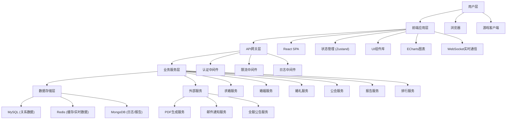
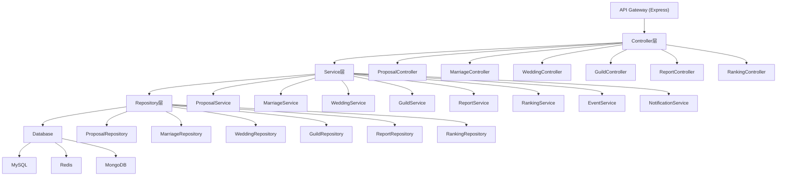
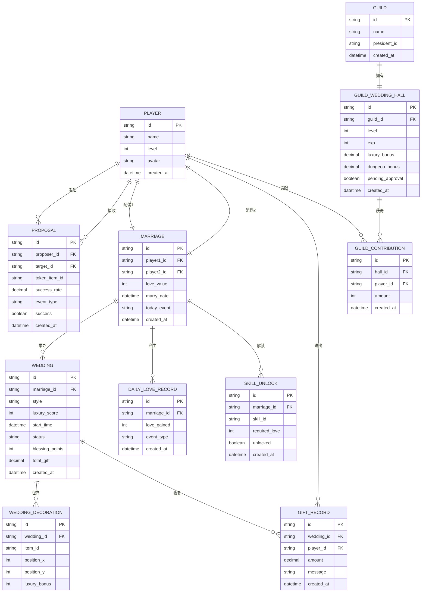

## 1. 架构设计



## 2. 技术描述

- **前端**：React@18 + TypeScript + Vite@5 + TailwindCSS@3 + Zustand@4 + ECharts@5 + Framer Motion@11
- **状态管理**：Zustand（轻量级，支持中间件）
- **后端**：Node.js + Express@4 + TypeScript
- **数据库**：MySQL 8.0 + Redis 7 + MongoDB 6
- **实时通信**：Socket.IO@4
- **PDF生成**：html2pdf.js + Chart.js
- **构建工具**：Vite@5
- **代码规范**：ESLint + Prettier + Husky

## 3. 路由定义

| 路由 | 页面 | 功能 |
|------|------|------|
| / | 首页 | 系统入口、导航、活动公告 |
| /proposal | 求婚页面 | 选择信物、计算成功率、发起求婚 |
| /marriage | 婚姻主页 | 双人技能、专属副本、恩爱值面板 |
| /wedding/prepare | 婚礼筹备 | 风格选择、礼堂布置、宾客邀请 |
| /wedding/live/:id | 婚礼现场 | 实时互动、祝福弹幕、礼金统计 |
| /guild/wedding-hall | 公会婚庆堂 | 建设面板、审批中心、贡献排行 |
| /reports/weekly | 姻缘报告 | 周报告、数据可视化、PDF导出 |
| /rankings | 排行榜 | 恩爱值榜、婚礼次数榜、公会贡献榜 |

## 4. API 定义

### 4.1 类型定义

```typescript
// 玩家信息
interface Player {
  id: string;
  name: string;
  level: number;
  avatar: string;
  intimacy: number;
}

// 道具信息
interface Item {
  id: string;
  name: string;
  quality: 'common' | 'rare' | 'epic' | 'legendary';
  qualityBonus: number;
  icon: string;
  description: string;
}

// 求婚请求
interface ProposalRequest {
  proposerId: string;
  targetId: string;
  tokenItemId: string;
}

// 求婚响应
interface ProposalResponse {
  success: boolean;
  successRate: number;
  event?: 'loveCalamity' | 'heavenlyBlessing' | null;
  message: string;
}

// 婚姻关系
interface Marriage {
  id: string;
  player1Id: string;
  player2Id: string;
  loveValue: number;
  marryDate: string;
  skills: string[];
  dungeonRemaining: number;
  todayEvent: 'sweet' | 'coldWar' | null;
}

// 婚礼信息
interface Wedding {
  id: string;
  coupleId: string;
  style: string;
  decorations: Decoration[];
  luxuryScore: number;
  startTime: string;
  status: 'preparing' | 'ongoing' | 'completed';
  guests: Guest[];
  blessingPoints: number;
  totalGift: number;
}

// 公会婚庆堂
interface GuildWeddingHall {
  guildId: string;
  level: number;
  exp: number;
  upgradeCost: number;
  luxuryBonus: number;
  dungeonBonus: number;
  pendingApproval: boolean;
}

// 周报告
interface WeeklyReport {
  weekStart: string;
  weekEnd: string;
  weddingStyleHeatmap: Record<string, number>;
  loveValueTrend: { date: string; avg: number }[];
  transactionTrend: { date: string; amount: number }[];
  radarData: {
    proposalSuccess: number;
    marriageHappiness: number;
    weddingLuxury: number;
    guildContribution: number;
    activityLevel: number;
  };
}
```

### 4.2 核心接口

| 接口 | 方法 | 描述 |
|------|------|------|
| /api/proposal/calculate | POST | 计算求婚成功率 |
| /api/proposal/submit | POST | 提交求婚请求 |
| /api/marriage/:id | GET | 获取婚姻信息 |
| /api/marriage/:id/skills | GET | 获取双人技能列表 |
| /api/marriage/:id/daily-love | POST | 领取每日恩爱值 |
| /api/wedding/prepare | POST | 创建婚礼筹备 |
| /api/wedding/:id/decorate | PUT | 更新婚礼布置 |
| /api/wedding/:id/calculate-luxury | GET | 计算婚礼豪华度 |
| /api/wedding/:id/start | POST | 开始婚礼 |
| /api/wedding/:id/blessing | POST | 发送祝福 |
| /api/guild/hall | GET | 获取公会婚庆堂信息 |
| /api/guild/hall/contribute | POST | 贡献婚庆堂建设 |
| /api/guild/hall/upgrade | POST | 提交升级申请 |
| /api/guild/hall/approve | POST | 审批升级申请 |
| /api/reports/weekly | GET | 获取周报告数据 |
| /api/reports/weekly/export | POST | 导出周报告PDF |
| /api/rankings/love-value | GET | 恩爱值排行榜 |
| /api/rankings/wedding-count | GET | 婚礼次数排行榜 |
| /api/rankings/guild-contribution | GET | 公会贡献排行榜 |

## 5. 服务端架构



## 6. 数据模型

### 6.1 ER图



### 6.2 DDL 语句

```sql
-- 玩家表
CREATE TABLE players (
    id VARCHAR(36) PRIMARY KEY,
    name VARCHAR(50) NOT NULL,
    level INT NOT NULL DEFAULT 1,
    avatar VARCHAR(255),
    created_at DATETIME NOT NULL DEFAULT CURRENT_TIMESTAMP,
    INDEX idx_level (level)
);

-- 亲密度关系表
CREATE TABLE intimacy (
    id VARCHAR(36) PRIMARY KEY,
    player1_id VARCHAR(36) NOT NULL,
    player2_id VARCHAR(36) NOT NULL,
    value INT NOT NULL DEFAULT 0,
    created_at DATETIME NOT NULL DEFAULT CURRENT_TIMESTAMP,
    UNIQUE KEY uk_pair (player1_id, player2_id),
    FOREIGN KEY (player1_id) REFERENCES players(id),
    FOREIGN KEY (player2_id) REFERENCES players(id)
);

-- 求婚记录表
CREATE TABLE proposals (
    id VARCHAR(36) PRIMARY KEY,
    proposer_id VARCHAR(36) NOT NULL,
    target_id VARCHAR(36) NOT NULL,
    token_item_id VARCHAR(36) NOT NULL,
    token_quality VARCHAR(20) NOT NULL,
    intimacy_value INT NOT NULL,
    success_rate DECIMAL(5,2) NOT NULL,
    event_type VARCHAR(20),
    success BOOLEAN NOT NULL,
    message TEXT,
    created_at DATETIME NOT NULL DEFAULT CURRENT_TIMESTAMP,
    INDEX idx_proposer (proposer_id),
    INDEX idx_target (target_id),
    INDEX idx_created_at (created_at),
    FOREIGN KEY (proposer_id) REFERENCES players(id),
    FOREIGN KEY (target_id) REFERENCES players(id)
);

-- 婚姻关系表
CREATE TABLE marriages (
    id VARCHAR(36) PRIMARY KEY,
    player1_id VARCHAR(36) NOT NULL,
    player2_id VARCHAR(36) NOT NULL,
    love_value INT NOT NULL DEFAULT 0,
    marry_date DATETIME NOT NULL,
    today_event VARCHAR(20),
    last_daily_claim DATE,
    dungeon_remaining INT NOT NULL DEFAULT 1,
    created_at DATETIME NOT NULL DEFAULT CURRENT_TIMESTAMP,
    UNIQUE KEY uk_player1 (player1_id),
    UNIQUE KEY uk_player2 (player2_id),
    FOREIGN KEY (player1_id) REFERENCES players(id),
    FOREIGN KEY (player2_id) REFERENCES players(id)
);

-- 婚礼表
CREATE TABLE weddings (
    id VARCHAR(36) PRIMARY KEY,
    marriage_id VARCHAR(36) NOT NULL,
    style VARCHAR(50) NOT NULL,
    luxury_score INT NOT NULL DEFAULT 0,
    start_time DATETIME NOT NULL,
    status VARCHAR(20) NOT NULL DEFAULT 'preparing',
    blessing_points INT NOT NULL DEFAULT 0,
    total_gift DECIMAL(15,2) NOT NULL DEFAULT 0,
    created_at DATETIME NOT NULL DEFAULT CURRENT_TIMESTAMP,
    INDEX idx_status (status),
    INDEX idx_start_time (start_time),
    FOREIGN KEY (marriage_id) REFERENCES marriages(id)
);

-- 婚礼布置表
CREATE TABLE wedding_decorations (
    id VARCHAR(36) PRIMARY KEY,
    wedding_id VARCHAR(36) NOT NULL,
    item_id VARCHAR(36) NOT NULL,
    item_name VARCHAR(100) NOT NULL,
    position_x INT NOT NULL,
    position_y INT NOT NULL,
    luxury_bonus INT NOT NULL,
    created_at DATETIME NOT NULL DEFAULT CURRENT_TIMESTAMP,
    FOREIGN KEY (wedding_id) REFERENCES weddings(id)
);

-- 礼金记录表
CREATE TABLE gift_records (
    id VARCHAR(36) PRIMARY KEY,
    wedding_id VARCHAR(36) NOT NULL,
    player_id VARCHAR(36) NOT NULL,
    amount DECIMAL(15,2) NOT NULL,
    message VARCHAR(200),
    created_at DATETIME NOT NULL DEFAULT CURRENT_TIMESTAMP,
    INDEX idx_wedding (wedding_id),
    INDEX idx_player (player_id),
    FOREIGN KEY (wedding_id) REFERENCES weddings(id),
    FOREIGN KEY (player_id) REFERENCES players(id)
);

-- 公会表
CREATE TABLE guilds (
    id VARCHAR(36) PRIMARY KEY,
    name VARCHAR(100) NOT NULL,
    president_id VARCHAR(36) NOT NULL,
    vice_president_id VARCHAR(36),
    created_at DATETIME NOT NULL DEFAULT CURRENT_TIMESTAMP,
    FOREIGN KEY (president_id) REFERENCES players(id),
    FOREIGN KEY (vice_president_id) REFERENCES players(id)
);

-- 公会成员表
CREATE TABLE guild_members (
    id VARCHAR(36) PRIMARY KEY,
    guild_id VARCHAR(36) NOT NULL,
    player_id VARCHAR(36) NOT NULL,
    role VARCHAR(20) NOT NULL DEFAULT 'member',
    contribution INT NOT NULL DEFAULT 0,
    joined_at DATETIME NOT NULL DEFAULT CURRENT_TIMESTAMP,
    UNIQUE KEY uk_player (player_id),
    INDEX idx_guild (guild_id),
    FOREIGN KEY (guild_id) REFERENCES guilds(id),
    FOREIGN KEY (player_id) REFERENCES players(id)
);

-- 公会婚庆堂表
CREATE TABLE guild_wedding_halls (
    id VARCHAR(36) PRIMARY KEY,
    guild_id VARCHAR(36) NOT NULL UNIQUE,
    level INT NOT NULL DEFAULT 1,
    exp INT NOT NULL DEFAULT 0,
    exp_to_next INT NOT NULL DEFAULT 1000,
    luxury_bonus DECIMAL(5,2) NOT NULL DEFAULT 0,
    dungeon_bonus DECIMAL(5,2) NOT NULL DEFAULT 0,
    pending_approval BOOLEAN NOT NULL DEFAULT FALSE,
    upgrade_applicant_id VARCHAR(36),
    created_at DATETIME NOT NULL DEFAULT CURRENT_TIMESTAMP,
    FOREIGN KEY (guild_id) REFERENCES guilds(id),
    FOREIGN KEY (upgrade_applicant_id) REFERENCES players(id)
);

-- 公会贡献记录表
CREATE TABLE guild_contributions (
    id VARCHAR(36) PRIMARY KEY,
    hall_id VARCHAR(36) NOT NULL,
    player_id VARCHAR(36) NOT NULL,
    amount INT NOT NULL,
    created_at DATETIME NOT NULL DEFAULT CURRENT_TIMESTAMP,
    INDEX idx_hall (hall_id),
    INDEX idx_player (player_id),
    FOREIGN KEY (hall_id) REFERENCES guild_wedding_halls(id),
    FOREIGN KEY (player_id) REFERENCES players(id)
);

-- 每日恩爱值记录表
CREATE TABLE daily_love_records (
    id VARCHAR(36) PRIMARY KEY,
    marriage_id VARCHAR(36) NOT NULL,
    love_gained INT NOT NULL,
    event_type VARCHAR(20),
    created_at DATETIME NOT NULL DEFAULT CURRENT_TIMESTAMP,
    INDEX idx_marriage (marriage_id),
    INDEX idx_created_at (created_at),
    FOREIGN KEY (marriage_id) REFERENCES marriages(id)
);

-- 双人技能表
CREATE TABLE skills (
    id VARCHAR(36) PRIMARY KEY,
    name VARCHAR(100) NOT NULL,
    description TEXT,
    required_love INT NOT NULL,
    icon VARCHAR(255),
    effect JSON,
    created_at DATETIME NOT NULL DEFAULT CURRENT_TIMESTAMP
);

-- 技能解锁表
CREATE TABLE skill_unlocks (
    id VARCHAR(36) PRIMARY KEY,
    marriage_id VARCHAR(36) NOT NULL,
    skill_id VARCHAR(36) NOT NULL,
    unlocked BOOLEAN NOT NULL DEFAULT FALSE,
    unlocked_at DATETIME,
    created_at DATETIME NOT NULL DEFAULT CURRENT_TIMESTAMP,
    UNIQUE KEY uk_marriage_skill (marriage_id, skill_id),
    FOREIGN KEY (marriage_id) REFERENCES marriages(id),
    FOREIGN KEY (skill_id) REFERENCES skills(id)
);

-- 排行榜缓存表（Redis存储，MySQL备份）
CREATE TABLE ranking_snapshots (
    id VARCHAR(36) PRIMARY KEY,
    ranking_type VARCHAR(50) NOT NULL,
    data JSON NOT NULL,
    created_at DATETIME NOT NULL DEFAULT CURRENT_TIMESTAMP,
    INDEX idx_type (ranking_type),
    INDEX idx_created_at (created_at)
);

-- 初始化技能数据
INSERT INTO skills (id, name, description, required_love, icon) VALUES
('skill_001', '心灵相通', '组队时双方攻击力+10%', 100, '💞'),
('skill_002', '同生共死', '一方生命值低于30%时，另一方获得50%减伤', 300, '💗'),
('skill_003', '比翼双飞', '双人移动速度+20%，可携手飞行', 500, '💖'),
('skill_004', '情比金坚', '解除双方所有控制效果，冷却5分钟', 800, '💝'),
('skill_005', '生死与共', '为对方承担50%伤害，持续10秒', 1200, '💘');
```
